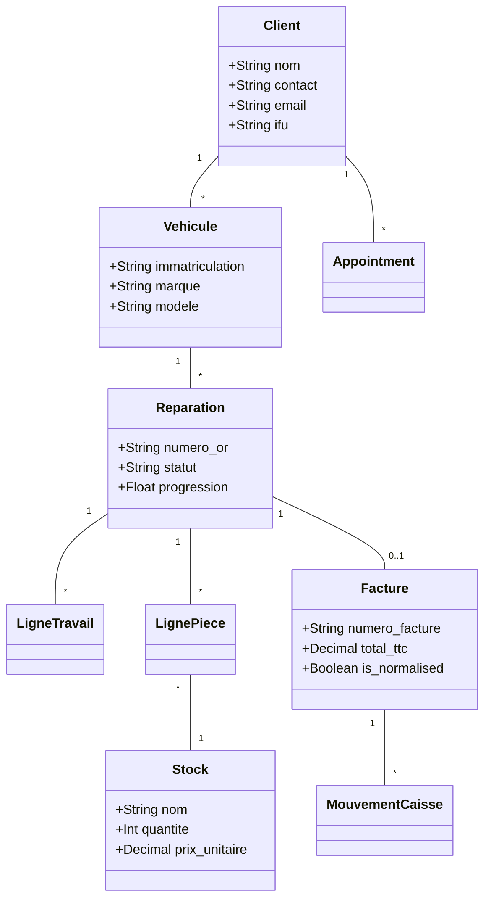
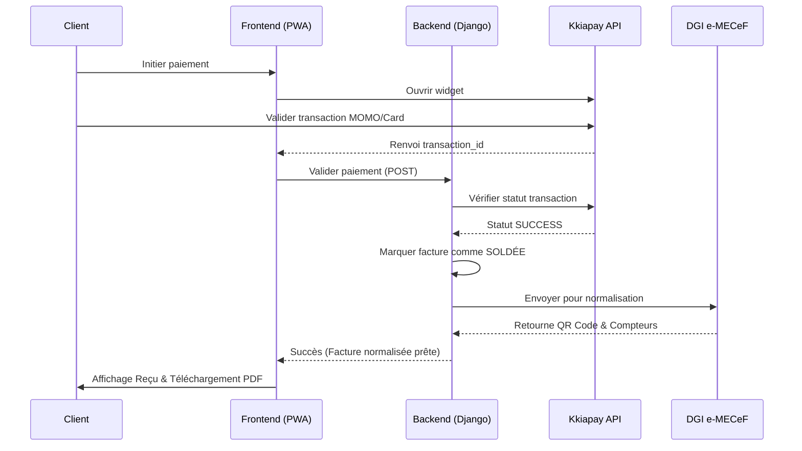

# Diagrammes UML - Projet LUXEL-G

Ce document regroupe l'ensemble des diagrammes UML du système de gestion de garage LUXEL-G, conçus en conformité avec les scénarios décrits dans le mémoire.

---

## 1. Diagramme de Cas d'Utilisation (Use Case)
Représente les fonctionnalités du système par acteur (Réceptionniste, Gérant, Client, Système).

```mermaid
useCaseDiagram
    actor "Réceptionniste" as Rec
    actor "Gérant" as Ger
    actor "Client" as Cli
    actor "Système" as Sys

    package "LUXEL-G System" {
        usecase "Authentification (OTP/Password)" as UC_Auth
        usecase "Prendre rendez-vous en ligne" as UC_RDV
        usecase "Gérer un ordre de réparation (OR)" as UC_OR
        usecase "Gérer devis, factures et paiements" as UC_Fact
        usecase "Gérer le stock de pièces" as UC_Stock
        usecase "Envoyer des notifications (SMS/Email)" as UC_Notif
    }

    Rec --> UC_Auth
    Rec --> UC_OR
    Rec --> UC_Fact
    Rec --> UC_Stock

    Ger --> UC_Auth
    Ger --> UC_Fact

    Cli --> UC_Auth
    Cli --> UC_RDV

    Sys --> UC_Notif
```

---

## 2. Diagramme de Classes
Structure de la base de données et relations entre les entités.



---

## 3. Diagrammes d'Activités

### A. Scénario : Prendre rendez-vous (Client)
```mermaid
activityDiagram
    start
    :Accéder au module RDV;
    :Choisir le type de service;
    :Sélectionner date et créneau;
    if (Créneau disponible ?) then (Non)
        :Proposer prochaines dates;
        backward: Sélectionner date;
    else (Oui)
    endif
    :Décrire les travaux souhaités;
    :Soumettre la demande;
    if (Infos complètes ?) then (Non)
        :Afficher erreur;
        backward: Décrire travaux;
    else (Oui)
    endif
    :Enregistrer RDV (Statut: En attente);
    :Envoyer confirmation par SMS;
    stop
```

### B. Scénario : Gérer un ordre de réparation (Réceptionniste)
```mermaid
activityDiagram
    start
    :Accéder au module OR;
    :Sélectionner le client;
    :Sélectionner le véhicule;
    if (Véhicule existe ?) then (Non)
        :Demander enregistrement véhicule;
        :Créer fiche véhicule;
    else (Oui)
    endif
    :Saisir symptômes et travaux;
    if (Champs obligatoires ?) then (Manquants)
        :Afficher erreur;
        backward: Saisir symptômes;
    else (Remplis)
    endif
    :Créer l'Ordre de Réparation;
    :Suivre l'évolution des travaux;
    stop
```

### C. Scénario : Gérer devis, factures et paiements
```mermaid
activityDiagram
    start
    :Sélectionner un OR;
    :Ajouter prestations et pièces;
    if (Pièce en stock ?) then (Non)
        :Afficher alerte stock;
        backward: Ajouter pièces;
    else (Oui)
    endif
    :Calcul automatique du total;
    :Générer Devis ou Facture;
    :Enregistrer le paiement;
    if (Paiement complet ?) then (Non)
        :Enregistrer montant partiel;
        :Facture en attente (Partiel);
    else (Oui)
    endif
    :Clôturer la transaction;
    stop
```

---

## 4. Diagramme de Séquence : Paiement Kkiapay & e-MECeF
Interaction entre le client, le frontend, le backend et les APIs externes.



---

## 5. Diagramme de Déploiement
Architecture physique de la solution.

```mermaid
deploymentDiagram
    node "Device Client" {
        component "PWA (React)"
    }
    node "Cloud Netlify" {
        component "Frontend Static"
    }
    node "Cloud PythonAnywhere" {
        component "Backend API (Django)"
        database "Base de données"
    }
    node "Services Tiers" {
        [Brevo SMS]
        [Kkiapay]
        [DGI e-MECeF]
    }

    "PWA (React)" -- HTTPS --> "Cloud Netlify"
    "PWA (React)" -- REST --> "Cloud PythonAnywhere"
    "Backend API (Django)" -- API --> "Services Tiers"
```
